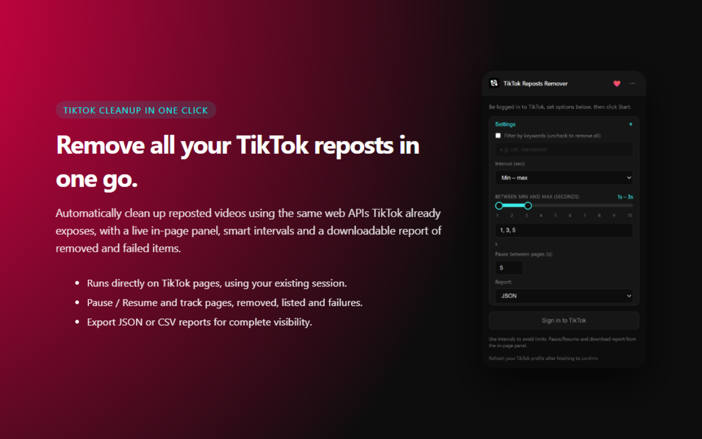

# TikTok All Reposted Videos Remover

Remove all your reposted videos on TikTok automatically with a single action, complete with an in-page dashboard, creator filters, simulation mode, rate-limit auto-cooldown, and downloadable audit reports.

---

## Features

- **Automated Profile Detection**: Opens your TikTok profile in a new tab and safely extracts session identifiers with multi-strategy fallbacks.
- **Smart Rate-Limit Auto-Cooldown**: Detects temporary TikTok limits (429 / status errors) and enters a safety cooldown countdown (35s) before retrying, rather than crashing or terminating.
- **Modern In-Page Dashboard**:
  - Live progress bar & metric pills (Pages, Removed, Skipped, Failed, ETA).
  - Preview card of currently processing video (author and caption).
  - Minimize button to collapse the panel into a compact floating pill widget.
  - Pause / Resume controls.
  - Downloadable audit report (JSON or CSV).
- **Customizable Filters & Limits**:
  - **Keyword filter**: Only remove reposts matching specific terms.
  - **Creator filter & Whitelist**: Remove only specific `@creator` reposts or protect/whitelist favorite creators.
  - **Max removals limit**: Set a maximum quota (e.g., delete only the last 50 reposts) or set to 0 for all.
  - **Dry-run / Simulation mode**: Scan and generate a complete report without deleting any video.
- **Completion Alerts**: Soft synthesized audio chime (Web Audio API) and browser desktop notifications when processing completes.
- **Multi-language Support**: Native internationalization for **Spanish (Español)**, **English**, **German**, **French**, **Portuguese**, **Turkish**, **Indonesian**, and **Malay**.

---

## Installation

### Manual Installation (Developer mode)

1. Clone or download this repository.
2. In Google Chrome, Brave, or Microsoft Edge, navigate to `chrome://extensions` (or `edge://extensions`).
3. Turn on **Developer mode** (top right switch).
4. Click **"Load unpacked"** (Cargar descomprimida) and select this project folder.

---

## How to use

1. Log in to your TikTok account on [tiktok.com](https://tiktok.com).
2. Click the extension icon in your browser toolbar.
3. Configure your preferences:
   - **Simulation mode (Dry run)**: Check to scan and generate a report without deleting anything.
   - **Keywords**: Filter by specific caption terms (optional).
   - **Creators**: Filter by `@username` and choose whether to remove only them or whitelist/protect them.
   - **Max removals limit**: Set to 0 to remove all, or enter a number (e.g. 50).
   - **Interval**: Set random range (e.g. 1s - 3s) to prevent rate limits.
   - **Report format**: JSON or CSV.
4. Click **Start Removing Reposts**.
5. A TikTok tab will open and the in-page panel will appear at the top-right corner.
6. Keep the tab open until finished. A notification and soft audio chime will let you know when it's done.

---

## Report format

The exported report includes:
- **JSON**: `{ "removed": [...], "failed": [...], "skipped": [...] }`
- **CSV**: Table with columns:
  - `id`
  - `authorName`
  - `desc`
  - `url`
  - `status` (`removed`, `failed`, or `skipped_filter`)
  - `timestamp`

---

## Permissions

- `host_permissions` (`https://*.tiktok.com/*`): Allows extension scripts to interact with TikTok.
- `scripting`: Runs content script and extracts session information.
- `tabs`: Opens and communicates with your TikTok profile tab.
- `cookies`: Checks login status locally in the popup.
- `storage`: Saves your preferences locally.
- `notifications`: Alerts you when removal completes.

*No external telemetry or tracking servers are used. All actions happen locally within your browser directly to TikTok.*

---

## License

This project is licensed under the [MIT License](LICENSE).
